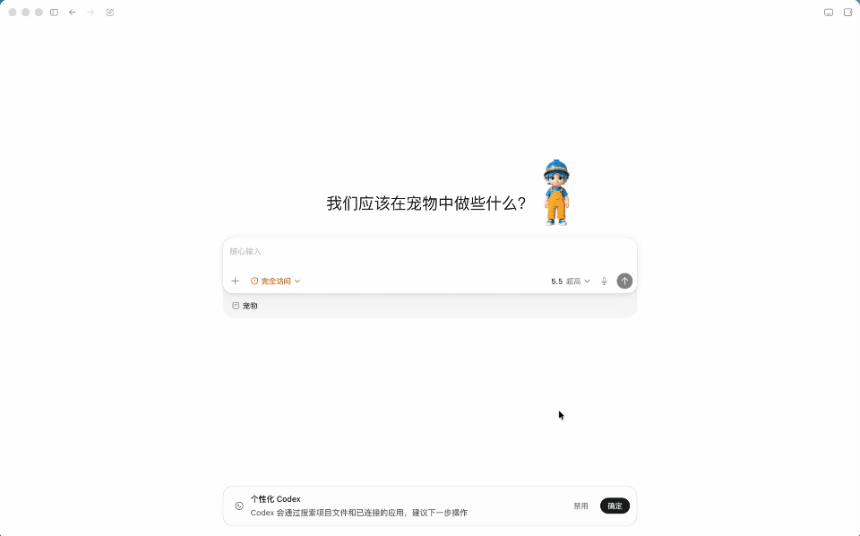
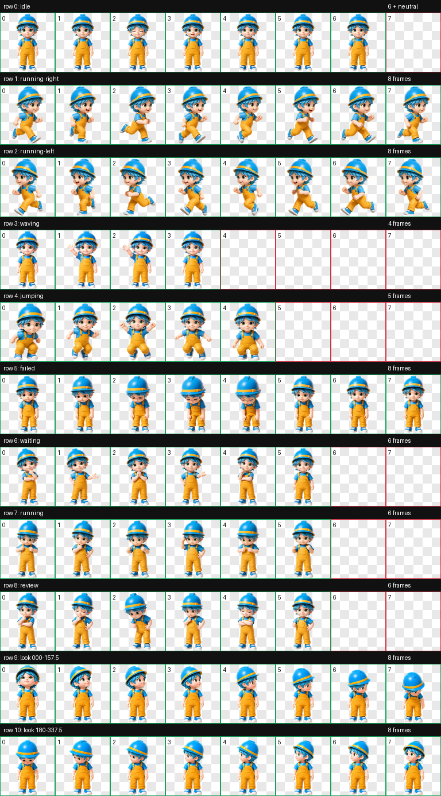
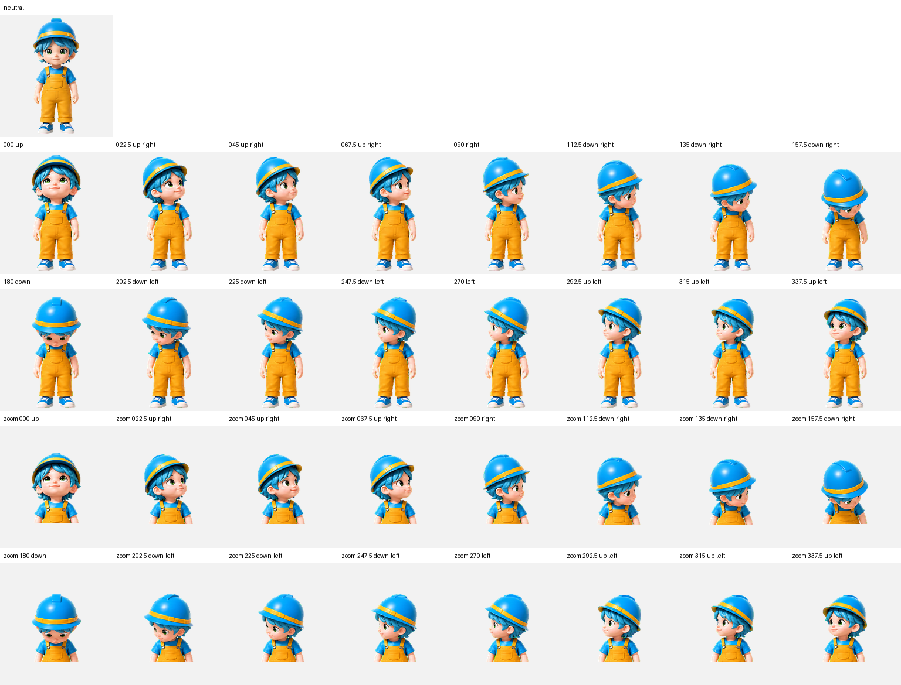

# 卡卡（Kaka）Codex Pet

卡卡是一个蓝色头发、蓝色安全帽和黄色工装造型的 3D 玩具风 Codex 宠物。当前版本为 v2，支持完整的标准动画和 16 个环视方向。

## 演示预览



## 下载

GitHub Release 提供两种 Codex v2 宠物包，原仓库中的图集与 QA 文件保持不变：

| 下载包 | 适合用户 | 内容 |
| --- | --- | --- |
| [标准安装版](https://github.com/zhiwendesign/kkpet/releases/download/kaka-v2.0.0/kaka-codex-pet-v2.zip) | 普通用户（推荐） | `kaka/pet.json`、`kaka/spritesheet.webp` |
| [完整资料版](https://github.com/zhiwendesign/kkpet/releases/download/kaka-v2.0.0/kaka-codex-pet-v2-with-qa.zip) | 需要检查制作质量的用户 | 相同宠物文件，并附带图集、方向与视觉 QA |

两个下载包使用同一套卡卡 v2 图集，区别仅在是否附带 QA 资料。解压后，将整个 `kaka` 文件夹复制到：

```text
~/.codex/pets/kaka
```

然后重启 Codex。若该位置已有同名宠物，请先备份原目录。

## 当前状态

- Pet ID：`kaka`
- Sprite 版本：`2`
- 图集尺寸：`1536 × 2288`
- 单帧尺寸：`192 × 208`
- 图集布局：`8` 列 × `11` 行
- 安装目录：`~/.codex/pets/kaka`
- 图集验证：通过，无错误或警告
- 独立视觉 QA：通过
- 四个方向基准：上、右、下、左全部通过盲测硬门槛

项目中只保留 v2 成品与 QA 资料，不再保留 v1 图集、清单、验证报告或备份。

## 文件位置

已安装的宠物：

```text
~/.codex/pets/kaka/
├── pet.json
└── spritesheet.webp
```

项目内的 v2 成品和验证资料：

```text
kaka-v2-run/
├── pet_request.json
├── final/
│   ├── spritesheet-extended.webp
│   ├── validation-extended.json
│   └── validation-packaged.json
└── qa/
    ├── contact-sheet-extended.png
    ├── look-directions.png
    ├── direction-semantics.json
    ├── direction-blind-validation.json
    ├── look-continuity.json
    ├── final-visual-qa.json
    ├── previews/
    └── run-summary.json
```

## 图集布局

| 行 | 状态 | 帧数 |
| --- | --- | ---: |
| 0 | idle | 6，另含 neutral 帧 |
| 1 | running-right | 8 |
| 2 | running-left | 8 |
| 3 | waving | 4 |
| 4 | jumping | 5 |
| 5 | failed | 8 |
| 6 | waiting | 6 |
| 7 | running | 6 |
| 8 | review | 6 |
| 9 | `000`–`157.5` | 8 |
| 10 | `180`–`337.5` | 8 |

16 个方向按顺时针排列：

```text
000, 022.5, 045, 067.5, 090, 112.5, 135, 157.5,
180, 202.5, 225, 247.5, 270, 292.5, 315, 337.5
```

其中 `000` 表示向上，`090` 表示屏幕右侧，`180` 表示向下，`270` 表示屏幕左侧。neutral 位于第 0 行第 6 列。

## 安装清单

`~/.codex/pets/kaka/pet.json`：

```json
{
  "id": "kaka",
  "displayName": "卡卡",
  "description": "A cheerful blue-haired 3D toy construction kid in a blue hard hat and yellow overalls.",
  "spriteVersionNumber": 2,
  "spritesheetPath": "spritesheet.webp"
}
```

`spriteVersionNumber: 2` 是必需字段；缺少它时，Codex 会按旧的九行格式读取图集。

## QA 预览

完整图集：



16 个环视方向：



方向连续性检测记录了少量中间角度和行边界的审阅提示，但标签化动画复核确认不存在方向反转、尺寸跳变、注册偏移或身份漂移，因此最终视觉 QA 通过。
